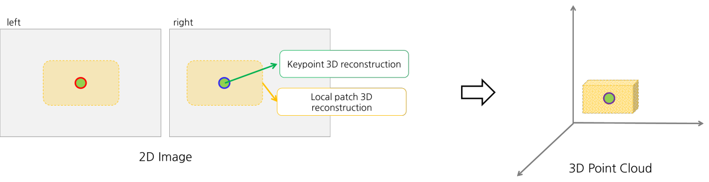
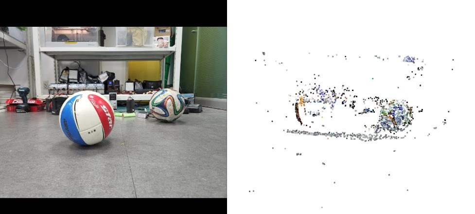
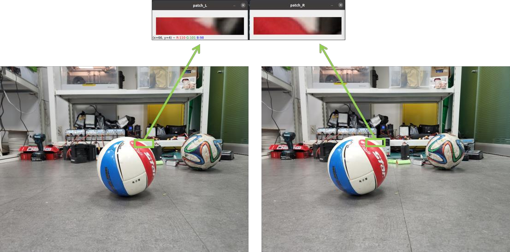
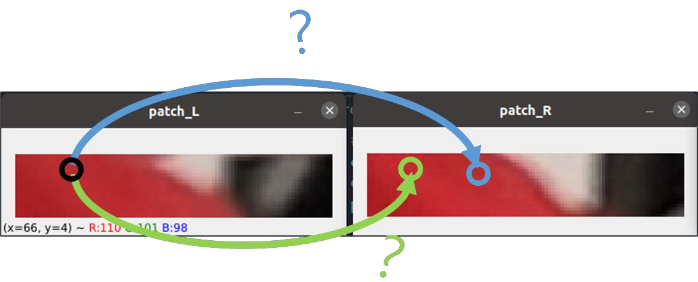
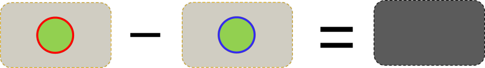
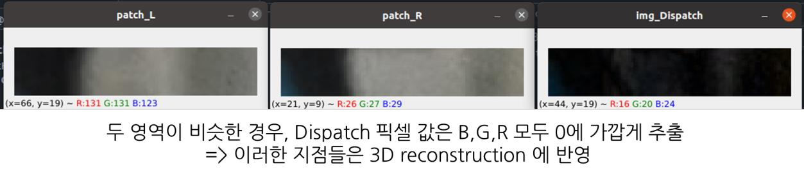
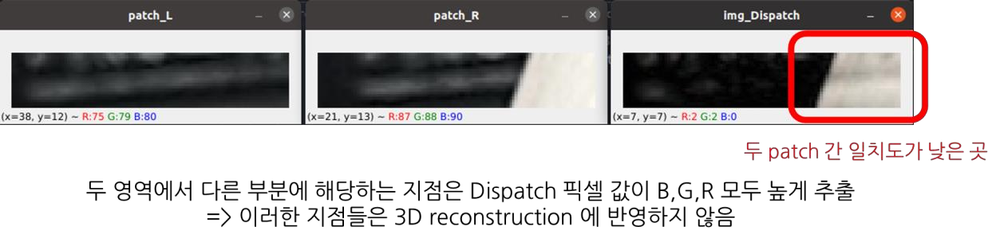
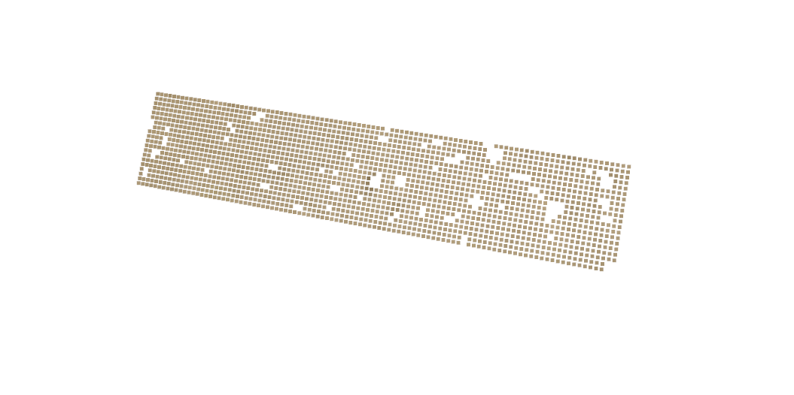
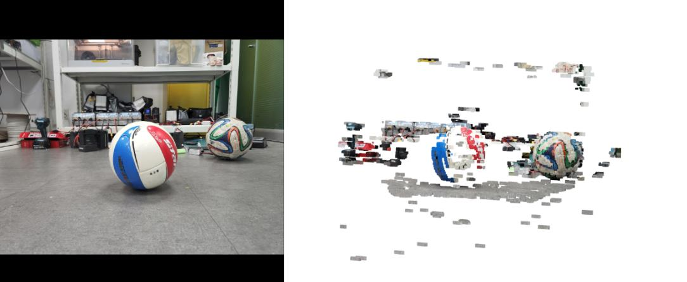
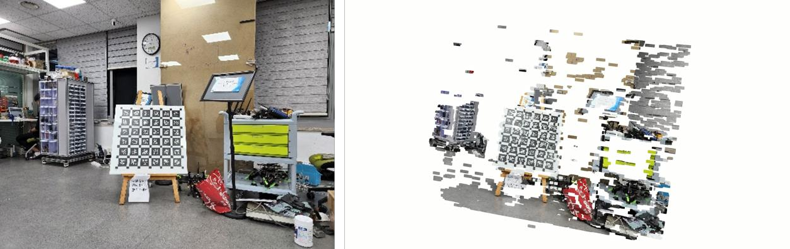

# Dispatch
2022 RSDP Mid-term project
**Dis**parity **patch** for Dense stereo matching

## What is ‘DisPatch’ ?
2장의 스테레오 이미지 만으로도 Dense한 3D reconstruction 을 가능케 하기 위해
고안한 ‘DisPatch’ 라는 모듈을 소개한다. 간단하게 다음과 같은 두가지의 기능으로 동작한다.



- **Keypoint 3D reconstruction**: SIFT 로 찾아낸 스테레오 이미지들의 Keypoint 들을 매칭 시킨 후 3D 좌표계로 변환해주는 기능이다.

- **Local Patch 3D reconstruction**: 두 스테레오 이미지의 Keypoint 주변의 매우 작은 patch 들을 뽑아낸 다음, 이 patch 들에 대해 스테레오 매칭을 부분적으로 수행하는 기능을 도입했다. 이를 이용하여 정확도를 높인 dense 스테레오 매칭을 수행할 수 있었다.

## How to run DisPatch?
```
Ubuntu 20.04
Python 3.8.10
OpenCV 4.5.5
Open3d 0.13.0 
```

파일(midterm_3Dreconstruction)을 다운로드 받으면 그 내부에 아래와 같은 3개의 폴더가 존재하는 것을 확인할 수 있다.
```
cd reconstruction
python feature_match.py
```
1) 카메라 캘리브레이션
2) 스테레오 이미지 undistortion
3) Keypoint 3d reconstruction
4) Local Patch 3D reconstruction 

을 차례대로 실행한 후, Open3D 로 3차원 공간상에 포인트 클라우드를 띄워주는 과정까지 확인할 수 있다.

## Folder 
- calib: 체커보드 캘리브레이션 이미지 15장이 들어있는 폴더
- stereo: 스테레오 이미지가 들어있는 폴더
- reconstruction: 코드 calibration.py 와 feature_matching.py 가 존재하는 폴더

## Camera Calibration
이미지 경로 calib에 있는 체커보드 이미지를 받아와 캘리브레이션을 수행한다. 이 때 사용한 방법은 Zhengyou Zhang 의 방법이다.

## Stereo Image Undistortion
OpenCV의 undistort function 사용

## SIFT, Knn Matcher Keypoint Extraction & 3D reconstruction
SIFT, Knn Matcher 로 Key point 들만 탐색한 후 3D reconstruction 을 수행한다.


## Local Patch 3D reconstruction - Dense Matching 을 사용하기 위한 Dispatch 알고리즘 도입
Dense Matching 을 위해 고안한 Dispatch 알고리즘을 적용한다.







## Result


